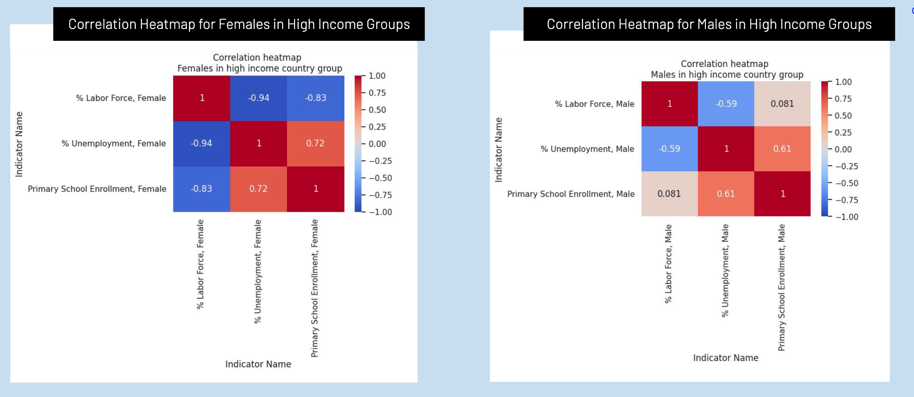

# A Global Analysis on Gender, Employment and School Enrollment

> Exploring correlations between key development indicators to inform policy and program design through nuanced analysis.

[]()  
[Pandas](https://img.shields.io/badge/Pandas-3.0-purple)
[]()

---

## Overview

Is primary school enrollment linked to labor force participation and unemployment in low-, middle-, and high-income countries across genders? Our team used data collected by the World Bank from across the globe to answer this question. By using data analysis and visualization techniques in Python with libraries like Pandas, Numpy, Matplotlib and Seaborn, we uncovered complex correlations between these indicators, highlighting their interdependece and producing insights for program and policy design.

## Table of contents

- [Data](#data)
- [File structure](#file-structure)
- [Methods](#methods)
- [Results](#results)
- [Key learnings](#key-learnings)
- [Contributors](#contributors)

## Data

| Dataset | Source | Description |
|---------|--------|-------------|
| WDI_Data | [Link](data/WDI_Data.xlsx) | Compilation of indicators pulled from the [World Bank Development Indicators](https://databank.worldbank.org/source/world-development-indicators) |


## File structure

```
├── data/           # raw and processed datasets
├── notebooks/      # analysis notebooks
├── images/         # charts and figures used in the README
├── docs/           # final report and presentation PDFs
└──README.md
```

## Methods

- Developed an actionable, specific research question.
- Fetched and merged World Bank indicator and income classification datasets.
- Filtered and reshaped data using melting, aggregation, and conditional exclusion based on missingness thresholds.
- Used data visualization to explore labor and education trends across gender and income groups.

📄 [Full report (PDF)](docs/final-report.pdf)

## Results



- The relationship between primary school enrollment and labor force participation varies by income level, with higher enrollment linked to higher unemployment for upper-middle and high-income groups for both males and females. 
- The relationship between enrollment and labor force participation is negative for most female groups and neutral to positive for most male
groups. 
- School enrollment generally has a stronger correlation with labor force participation for females than males, regardless of direction. These trends highlight the complex interaction between education, labor markets, and economic development across different income groups.
- These trends highlight the complex interaction between education, labor markets, and economic
development across different income groups. It is essential to note that these findings do not
imply causation; primary school enrollment data pertains to much younger populations than
those represented in labor force and unemployment statistics.

## Key learnings

- Gained proficiency in transforming and visualizing complex, multi-dimensional datasets with Pandas, Numpy, Matplotlib and Seaborn.
- Developed intuition for handling missingness and data consistency issues in data collection.
- Took a broad research questions and turned it into a structured exploratory analysis pipeline with actionable insights.

## Contributors

Maia Kennedy | Courtney Chen

UC Berkeley, MIDS | November 2024
